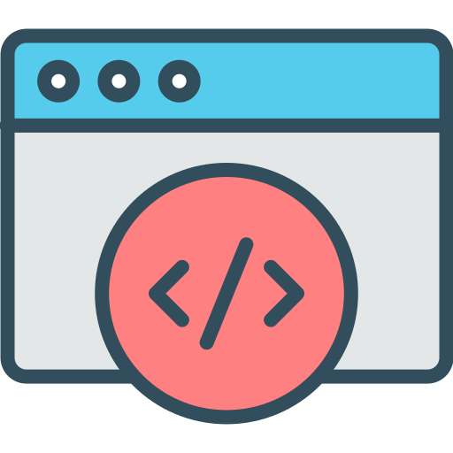
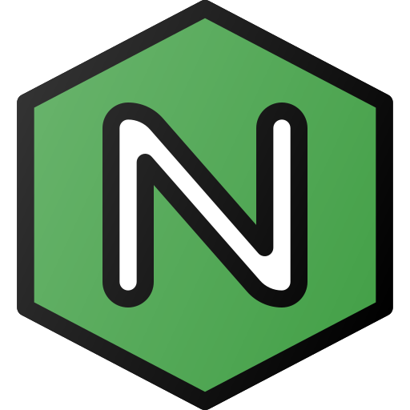
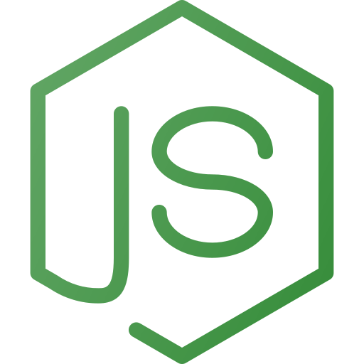
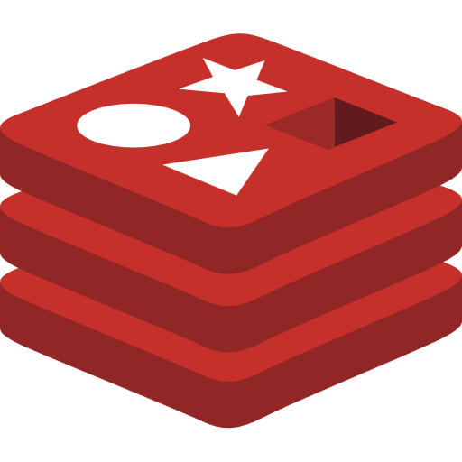

<div align="center">



# dev-stack

**Môi trường quản trị toàn diện Local Development Stack hiện đại, siêu tốc và an toàn cao cấp dành cho Windows & Linux.**

[](https://flutter.dev)
[](https://dart.dev)
[](#hệ-điều-hành-hỗ-trợ)
[](#chất-lượng-mã-nguồn--kiểm-thử)
[](#bản-quyền)

<p align="center">
  Tương tự như <b>Laragon</b> hoặc <b>Laravel Herd</b>, nhưng được xây dựng bằng <b>Flutter Desktop</b> với Clean Architecture, khả năng quản trị đa dịch vụ (Nginx, Caddy, Apache, PHP đa phiên bản, MySQL, PostgreSQL, Redis, MongoDB), tự động tạo SSL cục bộ và chứng thực bảo mật đa tầng.
</p>

---

</div>

## 📑 Mục lục

- [✨ Tính năng nổi bật](#-tính-năng-nổi-bật)
- [🛡️ Hệ thống Bảo mật Cấp cao (Hardened Security)](#️-hệ-thống-bảo-mật-cấp-cao-hardened-security)
- [📦 Danh mục Dịch vụ Hỗ trợ](#-danh-mục-dịch-vụ-hỗ-trợ)
- [🖥️ Hệ điều hành Hỗ trợ](#️-hệ-điều-hành-hỗ-trợ)
- [🚀 Bắt đầu Nhanh (Getting Started)](#-bắt-đầu-nhanh-getting-started)
  - [Yêu cầu hệ thống](#yêu-cầu-hệ-thống)
  - [Cài đặt & Chạy từ Mã nguồn](#cài-đặt--chạy-từ-mã-nguồn)
  - [Đóng gói Installer cho Windows](#đóng-gói-installer-cho-windows)
- [🏛️ Kiến trúc & Thiết kế (Architecture)](#️-kiến-trúc--thiết-kế-architecture)
- [🧪 Chất lượng Mã nguồn & Kiểm thử](#-chất-lượng-mã-nguồn--kiểm-thử)
- [🤝 Đóng góp & Phát triển](#-đóng-góp--phát-triển)

---

## ✨ Tính năng nổi bật

- **Quản lý Web Server Đa dạng**: Chuyển đổi linh hoạt giữa **Nginx**, **Caddy** và **Apache** chỉ với 1 click. Tự động sinh vhost và proxy cấu hình FastCGI tương thích hoàn toàn.
- **PHP Đa Phiên bản (Multi-version PHP)**: Hỗ trợ chuyển đổi mượt mà giữa PHP 7.4, 8.0, 8.1, 8.2, 8.3, 8.4, 8.5. Tích hợp tự động cài đặt Composer và quản lý PHP-FPM.
- **Cơ sở dữ liệu Đa Nền tảng**:
  - Hỗ trợ khởi chạy và cấu hình **MySQL**, **MariaDB**, **PostgreSQL**, **MongoDB**, **Redis**, **Elasticsearch**, **Meilisearch**.
  - Quản lý Database / User trực quan và tích hợp sẵn công cụ quản trị GUI (**phpMyAdmin**, **HeidiSQL**, **MongoDB Compass**).
- **Tự động hóa Virtual Hosts & SSL**:
  - Tự động gán domain cục bộ (`.test`, `.local`) và cập nhật `/etc/hosts` (hoặc `C:\Windows\System32\drivers\etc\hosts`) an toàn.
  - Tự động sinh chứng chỉ **Local SSL (HTTPS)** bằng CA nội bộ đáng tin cậy.
- **Quản trị Runtimes Hiện đại**: Quản lý các runtime ngôn ngữ tiện lợi với **Node.js** và **pyenv**.
- **Trình biên tập Cấu hình Tích hợp (Inline Code Editor)**: Chỉnh sửa trực tiếp `php.ini`, `nginx.conf`, `httpd.conf`, `Caddyfile`, `my.ini` với syntax highlight mà không cần mở trình soạn thảo ngoài.
- **Tích hợp System Tray & Khởi động cùng Hệ thống**: Thu nhỏ gọn gàng xuống khay hệ thống, hỗ trợ auto-start các dịch vụ nền khi bật máy.

---

## 🛡️ Hệ thống Bảo mật Cấp cao (Hardened Security)

`dev-stack` được gia cố toàn diện qua đợt kiểm toán bảo mật đa tác tử (Multi-agent Dynamic Workflow Audit) với 4 giai đoạn bảo mật nghiêm ngặt:

| Tiêu chuẩn bảo mật | Cơ chế bảo vệ trong dev-stack |
| :--- | :--- |
| **Bảo vệ Chuỗi Cung ứng (VULN-12)** | Kiểm tra mã băm **SHA-256 Checksum** dạng stream trước khi giải nén payload; bắt buộc giao thức **HTTPS** tuyệt đối cho mọi Catalog URL. |
| **Mã hóa Mật khẩu Cục bộ (VULN-11)** | Mật khẩu database được mã hóa an toàn qua `LocalSecretVault` (HMAC-SHA256 authenticated encryption, random IV) trước khi lưu vào Isar DB. Tương thích ngược trong suốt với dữ liệu cũ. |
| **Phòng chống Path Traversal (VULN-08)** | Bộ giải nén Tar & Zip được trang bị thuật toán tiền kiểm tra `isSafeTarEntry`, chặn đứng các payload chứa `../`, drive letters hoặc absolute paths. |
| **Ngăn chặn Command Injection (VULN-01 & VULN-02)** | Loại bỏ hoàn toàn `runInShell: true` trên POSIX; siết chặt danh sách trắng `PackageCommandValidator`, loại bỏ các binary nguy hiểm (`sudo`, `pkexec`, `tee`). |
| **Bảo vệ Vòng đời Tiến trình (LIFE-01 & LIFE-02)** | Tiêu diệt tiến trình con theo **Process Group Kill** (`kill -9 -- -$pid`) trên Linux để triệt tiêu zombie/orphan worker Nginx/PHP; đồng bộ hóa trạng thái qua `systemctl is-active`. |
| **Phân quyền Tối thiểu (VULN-04, 05, 07, 14)** | Gán quyền `0600` cho file tạm `/tmp/ponta_hosts_*`; chỉ cấp quyền thực thi nhị phân thay vì `chmod -R 755`; ghi nhật ký kiểm toán (audit log) trước mọi lệnh `pkexec`. |

---

## 📦 Danh mục Dịch vụ Hỗ trợ

<div align="center">

| Web Servers | Ngôn ngữ & Runtimes | Cơ sở Dữ liệu & Cache | Công cụ Quản trị |
| :---: | :---: | :---: | :---: |
| <br/>**Nginx** | <br/>**PHP 7.4 - 8.5** | <br/>**MySQL** | <br/>**phpMyAdmin** |
| <br/>**Caddy** | <br/>**Node.js** | <br/>**MariaDB** | <br/>**HeidiSQL** |
| <br/>**Apache** | <br/>**Python (pyenv)** | <br/>**PostgreSQL** | <br/>**MongoDB Compass** |
| | | <br/>**Redis / Valkey** | |
| | | <br/>**MongoDB** | |
| | | <br/>**Elasticsearch** | |
| | | <br/>**Meilisearch** | |

</div>

---

## 🖥️ Hệ điều hành Hỗ trợ

- **Windows**: Windows 10 / Windows 11 (64-bit). Hỗ trợ cài đặt độc lập (standalone packages) trong `C:\dev-stack`.
- **Linux**: Ubuntu / Debian / Fedora / Arch Linux / openSUSE / Alpine.
  - Tự động nhận diện bản phân phối Linux qua `LinuxDistroResolver`.
  - Hỗ trợ cài đặt cả gói Portable (Jirutka static binary, Valkey prebuilt, Zonky PostgreSQL) lẫn gói Package Manager hệ thống (`apt`, `dnf`, `pacman`).

---

## 🚀 Bắt đầu Nhanh (Getting Started)

### Yêu cầu hệ thống

- **Flutter SDK**: `>= 3.10.4` (Khuyến nghị Flutter 3.41+).
- **Dart SDK**: `^3.10.4` (hoặc Dart 3.11+).
- **Windows**: Visual Studio 2022 với Desktop development with C++.
- **Linux**: `clang`, `cmake`, `ninja-build`, `pkg-config`, `libgtk-3-dev`.

### Cài đặt & Chạy từ Mã nguồn

1. **Clone repository về máy**:
   ```bash
   git clone https://github.com/ngotuananh101/dev-stack.git
   cd dev-stack
   ```

2. **Cài đặt dependencies**:
   ```bash
   flutter pub get
   ```

3. **Sinh mã nguồn (Isar & Riverpod Generators)** *(chỉ cần nếu sửa đổi models)*:
   ```bash
   dart run build_runner build --delete-conflicting-outputs
   ```

4. **Khởi chạy ứng dụng**:
   - Trên **Windows**:
     ```bash
     flutter run -d windows
     ```
   - Trên **Linux**:
     ```bash
     flutter run -d linux
     ```

### Đóng gói Installer cho Windows

Ứng dụng hỗ trợ đóng gói thành tệp cài đặt `.exe` tiện lợi thông qua **Inno Setup**:

1. Cài đặt **Inno Setup 6** từ [jrsoftware.org](https://jrsoftware.org/isdl.php).
2. Chạy script đóng gói tự động trong PowerShell:
   ```powershell
   .\scripts\package.ps1
   ```
3. Bộ cài đặt sẽ được tạo ra tại thư mục `innosetup\Output\`.

---

## 🏛️ Kiến trúc & Thiết kế (Architecture)

Dự án áp dụng chặt chẽ kiến trúc **Clean Architecture** kết hợp với **Riverpod State Management**:

```
lib/
├── core/
│   ├── config/             # Config Builders (Nginx, Caddy, Apache) & AppConfig
│   ├── database/           # Isar Singleton Provider & Concurrency Mutex Lock
│   ├── security/           # LocalSecretVault (Mã hóa đối xứng HMAC-SHA256)
│   ├── services/           # SSL, Path, Process, Logger, Distro Resolver
│   └── theme/              # Typography, Colors, Themes
├── features/
│   ├── apps/               # Quản lý vòng đời tải, cài đặt và giám sát App / Service
│   ├── databases/          # Quản lý Database Records, Users, Passwords & Isar
│   ├── hosts/              # Quản lý Virtual Hosts, Local Domain & System Hosts
│   ├── sites/              # Quản lý Projects, Virtual Hosts, SSL Certificates
│   └── settings/           # Cài đặt ứng dụng, Port bindings, Preferences
└── shared/                 # Reusable UI Widgets, Code Editor, Dialogs
```

### Các Mẫu Thiết kế Nổi bật (Design Patterns)
- **Config Builder Pattern**: Tách rời sinh cấu hình thành `NginxConfigBuilder`, `ApacheConfigBuilder`, `CaddyConfigBuilder`, chuẩn hóa đường dẫn POSIX/Windows.
- **Strategy & Pipeline Pattern**: Phân rã quy trình cài đặt `AppInstallerService.install()` thành chuỗi thực thi độc lập: tải payload ➔ xác thực checksum ➔ giải nén an toàn ➔ cấu hình database ➔ cấu hình runtime ➔ cấu hình webserver.
- **Async Mutex / Single-Flight Pattern**: Khóa luồng đồng thời `IsarInstance.getInstance()` bằng `Completer` để triệt tiêu race condition lúc khởi động ứng dụng.

---

## 🧪 Chất lượng Mã nguồn & Kiểm thử

Dự án duy trì quy trình kiểm thử tự động nghiêm ngặt theo phương pháp **Test-Driven Development (TDD)**:

- **100% Tests Pass**: **424 / 424 tests PASS** (0 failures, 0 skipped).
- **Linter Sạch sẽ**: `flutter analyze` đạt **0 issues**.
- **Độ bao phủ kiểm thử**:
  - Unit tests cho toàn bộ Config Builders (Nginx, Apache, Caddy).
  - Kiểm thử phát hiện và ngăn chặn lỗ hổng bảo mật: Tar Path Traversal, Command Injection, Bypass Validator, Checksum Mismatch, Secret Vault Tampering.
  - Mock integration tests cho Process Group signals, Systemctl lifecycles, và elevated command execution.

Chạy toàn bộ kiểm thử bất kỳ lúc nào với lệnh:
```bash
flutter test
```

Kiểm tra phân tích tĩnh:
```bash
flutter analyze
```

---

## 🤝 Đóng góp & Phát triển

Mọi ý kiến đóng góp, báo cáo lỗi (issue) và yêu cầu kéo (pull request) đều được hoan nghênh!

1. Fork dự án.
2. Tạo nhánh tính năng mới (`git checkout -b feature/AmazingFeature`).
3. Commit các thay đổi (`git commit -m 'feat: add some AmazingFeature'`).
4. Đẩy lên nhánh của bạn (`git push origin feature/AmazingFeature`).
5. Mở một Pull Request.

---

<div align="center">
  <sub>Được xây dựng và phát triển với ❤️ dành cho cộng đồng lập trình viên.</sub>
</div>
